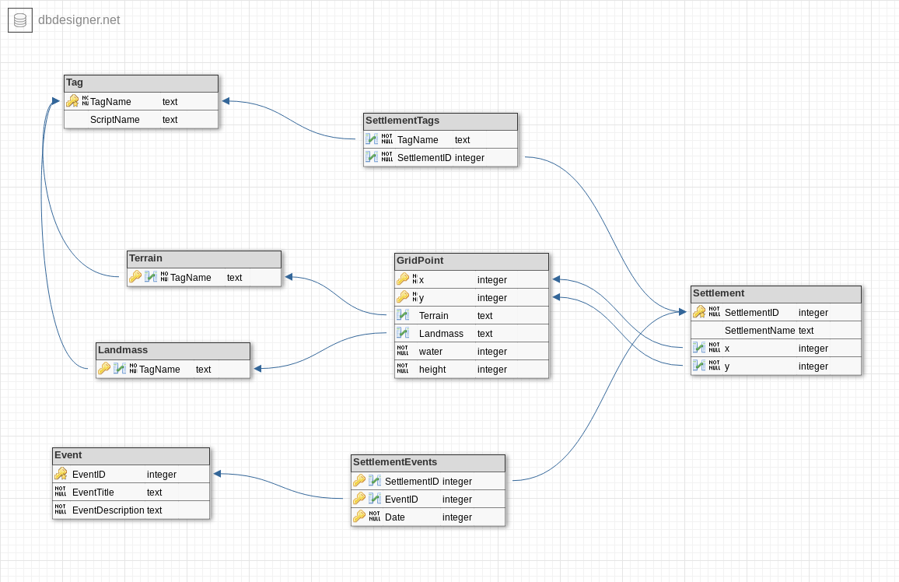

# High Level Design #
This will describe the purpose of the contents of each folder in this directory.

### Source Tree ###
- lib
	- This folder contains code from other sources I did not write.
- MapGenSystem
	- This folder contains code relating to Maps and Map Generation.
- utils
	- This folder contains utilities and helpers useful in various locations which I wrote.
- Bindings
	- This folder will contain language specific binding code for languages which can be used to extend WorldArchitect
- EventSystem
	- This folder contains the code relating to Events and the Events system.
- UI
	- This folder contains code for User Interaction.
- TagSystem
	- This folder contains code relating to Tags and the Tags system.
		- Need way to classify Tags. Three labels : Terrain, HasRequirements (*other Tags*), Other(?)
- SettlementSystem
	- This folder contains code relating to Settlements.
- SQLite
	- This folder contains code for the SQLite storage system. Many systems will be switching to using this behind the scenes.
	- Schema : 

### Notes ###
Previously, there was a TerrainSystem folder and a RaceSystem folder. This functionality has been folded into the TagSystem.

Plan for later : Once I get to serializing Maps and whatnot, a Map will have to provide a method to serialize itself to and from 
some markup language (JSON?). This will mean I can control file system io and I won't have to worry about allowing arbitrary scripts
arbitrary file access.

### Api Notes ###
- Maps
	- Has conditions a Settlement or Tag can access
- Settlements
	- Has lists of Tags and Events which have occured here.
- Events
	- Needs the Tags of a Settlement
- Tags
	- Needs to access other tags for a Settlement and/or Map conditions at that point.
- UI
	- Provides methods for requesting user input and potentially displaying information to the user.
- Bindings
	- Will provide the language specific configuration/setup/loading for the various bindings for WorldArchitect.
	- The classes which represent those extensions will live in the same folder as the rest, this will just be environment setup code.

